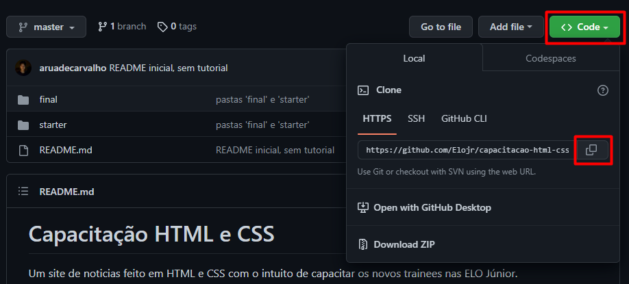

# Capacitação HTML e CSS

Um site de noticias feito em HTML e CSS com o intuito de capacitar os novos trainees da ELO Júnior.

## 👨‍💻 Sobre mim

Eu sou Aruã de Carvalho, tenho 20 anos e faço engenharia mecânica na UFG. Estou na ELO há 6 meses e atuo como desenvolvedor Frontend.

[](https://github.com/aruadecarvalho)


## Instalação



```bash
  git clone https://github.com/Elojr/capacitacao-html-css-2022.git
```


## Recursos

- [MDN Web Docs](https://developer.mozilla.org/)
- [Tutorial Flexbox](https://www.joshwcomeau.com/css/interactive-guide-to-flexbox/)
- [CSS Tricks](https://css-tricks.com/)
- [Google Fonts](https://fonts.google.com/)
- [Unsplash](https://unsplash.com/)
- [w3schools](https://www.w3schools.com/)
- [CSS Dinner](https://css-diner.netlify.app/)
- [Flexbox Froggy](https://flexboxfroggy.com/#fr)
